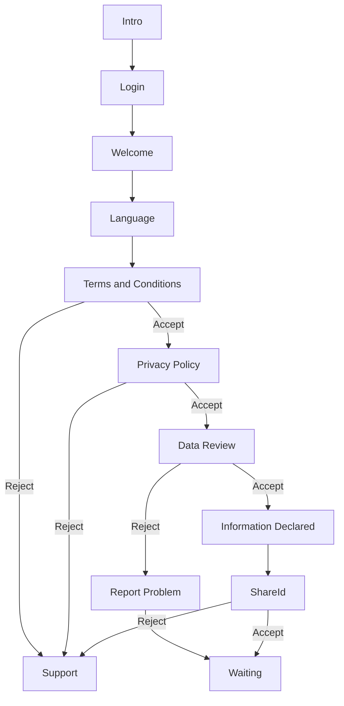

```mermaid
graph TD
    A[Intro] --> B[Login]
    B --> C[Welcome]
    C --> D[Language]
    D --> E[Terms and Conditions]
    E -->|Reject| J[Support]
    E -->|Accept| F[Privacy Policy]
    F -->|Reject| J
    F -->|Accept| G[Data Review]
    G -->|Reject| H[Report Problem]
    H --> K[Waiting]
    G -->|Accept| I[Information Declared]
    I --> L[ShareId]
    L -->|Reject| J
    L -->|Accept| K
```
